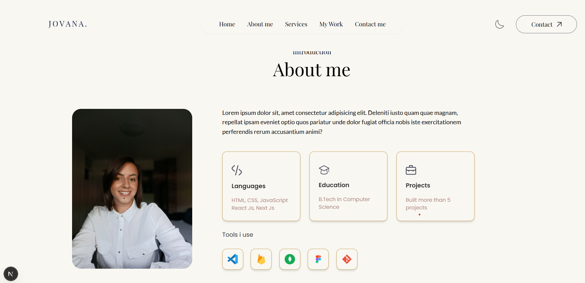

# Personal Portfolio Website

A modern personal portfolio website built to showcase my web development projects, skills, and experience.

## 🔗 Live Demo

(https://your-live-link.com)

## 📸 Preview

## 🚀 Features

- Fully responsive design
- Clean and modern UI
- Project showcase section
- Contact form
- Optimized performance

## 🛠 Technologies

- HTML
- CSS
- JavaScript
- React
- Vite

## 💡 About

This portfolio represents my work as a frontend developer, with a focus on clean design, usability, and responsive user interfaces.
